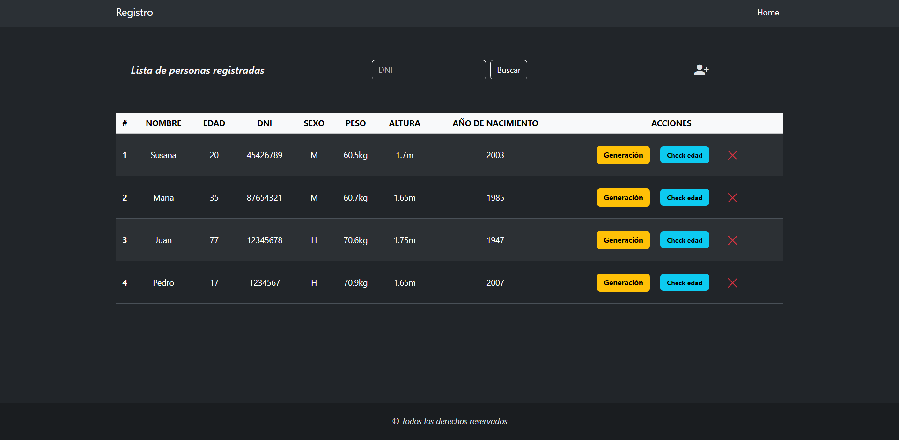

<p align='center'>
  <a href="https://adivinaelnumerojs.netlify.app/">
    
  </a>
</p>
<div align='center'>
  <a href="https://developer.mozilla.org/es/docs/Web/HTML">
    
  </a>
  <a href="https://developer.mozilla.org/es/docs/Web/CSS">
    
  </a>
  <a href="https://developer.mozilla.org/es/">
    
  </a>
  <a href="https://getbootstrap.com/">
    
  </a>
</div>

<div align='center'>

## Repositorio 
Este repositorio es un ejercicio de JavaScript, enfocado en la manipulación del DOM (Document Object Model). 
Esto tiene como finalidad mejorar mis habilidades en la interacción y modificación de elementos en la página web y en el navegador.

Estoy utilizando este espacio para aprender y practicar diferentes técnicas y métodos que nos ofrece JavaScript para interactuar con el contenido y la estructura de las páginas web, así como con el entorno del navegador.

## Descripción 📃
Es una pequeña página en la que puedes registras usuarios con sus respectivos datos, los cuales son verificados a través de validaciones con JavaScript. Estos se muestran en una tabla, la cual ofrece algunas acciones que puedes realizar con cada persona registrada, también puedes buscar una persona registrada en particular a través de su DNI…

Espero que te diviertas probando esto 😁

## DEMO 🌍

Mira una demostración del proyecto [aqui](https://registrodepersonas.netlify.app/)

</div>

<div align="center">

## Consigna 

`
Crea una clase llamada Persona que siga las siguientes condiciones:
Sus propiedades son: nombre, edad, DNI, sexo (H hombre, M mujer), peso y altura, año de nacimiento. Si quieres añadir alguna propiedad extra puedes hacerlo.
Los métodos que se debe poder utilizar  son:
mostrarGeneracion: este método debe mostrar un mensaje indicando a qué generación pertenece la persona creada y cual es el rasgo característico de esta generación.
Para realizar este método tener en cuenta la siguiente tabla de generaciones:

esMayorDeEdad: indica si es mayor de edad, devuelve un mensaje indicando que la persona es mayor de edad.
mostrarDatos: devuelve toda la información del objeto.
Luego crea la interfaz necesaria para que el usuario pueda crear un objeto persona, permitiendo ingresar las propiedades mediante un formulario, también agregar los botones “mostrar generación”, es “mayor de edad” e indicar en un alert el resultado de la función correspondiente.
`
</div>

<div align="center">

## Instalación

Clona este repositorio en tu máquina local usando `git`:
</div>

```bash
$ git clone https://github.com/WalterGonzalez33/lista_clasePersona.git
$ cd lista_clasePersona
```
<div align="center">

## Desarrollador 💻

<div>
  <a href="https://github.com/WalterGonzalez33">
    
  </a>
</div>

 [Walter Gonzalez](https://github.com/WalterGonzalez33) 
</div>

<div align="center">
    <p>¡Gracias por visitar este repositorio! 🎉</p>
</div>
